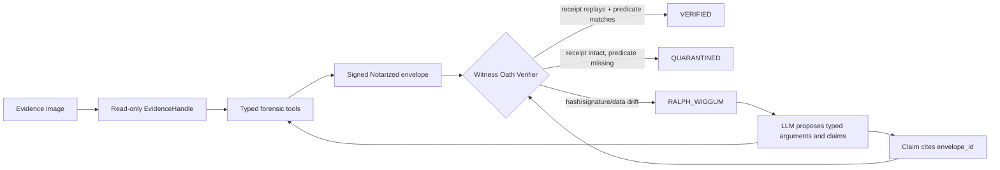

# OATH

Verifier-gated evidence receipts for LLM-assisted digital forensics.

[](https://doi.org/10.5281/zenodo.20549726)
[](https://doi.org/10.5281/zenodo.20549626)

OATH is a research prototype for making forensic claims replayable. It separates
what an LLM proposes from what the evidence proves: forensic tools produce signed
`Notarized<T>` envelopes, and the Witness Oath Verifier promotes only claims that
can be deterministically re-derived from the original evidence bytes.

This repository supports the published preprint:

> **OATH: Notarized Evidence Envelopes for LLM-Assisted Forensic Claims**
> Zenodo DOI: [10.5281/zenodo.20549726](https://doi.org/10.5281/zenodo.20549726)

The verifier artifact is archived separately at
[10.5281/zenodo.20549626](https://doi.org/10.5281/zenodo.20549626).

## Core Idea

LLM-assisted investigation fails dangerously when a fluent model summary is
treated as evidence. OATH treats that as a systems problem. A finding is not
accepted because the model said it; it is accepted only when it cites a signed
receipt whose contents replay.

Each `Notarized<T>` envelope binds:

- original evidence hash
- typed tool name and version
- canonical tool arguments
- raw tool-output hash
- parsed-data hash
- supporting byte offsets when available
- model identifier and prompt hash when an LLM contributed
- previous-envelope hash for tamper-evident sequencing
- Ed25519 signature over the signed header

The verifier then classifies claims as:

- `VERIFIED`: the receipt and predicate replay successfully
- `QUARANTINED`: the receipt is intact, but the cited claim is not supported
- `RALPH_WIGGUM`: evidence drift or receipt tampering is detected, forcing visible
  abandonment and re-proposal

## Results

The benchmark is DFIR-Metric Module III, using 510 scored string-search
questions in the local harness and a four-candidate answer budget.

| System | TUS@4 |
|---|---:|
| GPT-4.1 published baseline | 38.5% |
| OATH deterministic baseline, no LLM | 78.43% |
| OATH live agent with verifier | 92.75% |

The architectural result matters more than the model headline: typed tool
invocation plus deterministic replay removes a large class of free-form
script-generation failures before any model-specific capability is counted.

Full methodology and audit notes are in [docs/ACCURACY.md](docs/ACCURACY.md).

## Artifact Release

A verifier-focused artifact release is archived on Zenodo:

- Artifact: [OATH verifier artifact v0.1.0](https://doi.org/10.5281/zenodo.20549626)
- Preprint: [OATH: Notarized Evidence Envelopes for LLM-Assisted Forensic Claims](https://doi.org/10.5281/zenodo.20549726)

The release is intended to let an independent reviewer answer the narrow
question: does the receipt, signature, canonicalization, replay, and
self-correction design work? It does not include private case data, signing
secrets, API keys, or operational prompts.

## Quick Start

```bash
git clone https://github.com/GharsallahDev/oath
cd oath

python -m venv .venv
source .venv/bin/activate
python -m pip install -e ".[dev]"

PYTHONPATH=src python -m pytest tests/integration/test_spoliation.py -q
PYTHONPATH=src python scripts/show_self_correction.py
```

For a full local run against forensic tools, install the pinned toolchain first:

```bash
bash scripts/install-tools.sh
source .oath-tools/env.sh

oath mount path/to/evidence.E01
oath verify <envelope-id>
```

Linux forensic workstation setup is documented in
[docs/TRY_IT_OUT.md](docs/TRY_IT_OUT.md).

## Architecture



OATH uses a custom MCP-style tool surface with typed functions rather than an
arbitrary shell. The LLM can propose arguments and hypotheses; it cannot promote
its own findings. Promotion is reserved for the deterministic verifier.

Detailed trust-boundary notes are in [docs/ARCHITECTURE.md](docs/ARCHITECTURE.md).

## Repository Map

| Path | Purpose |
|---|---|
| `src/oath/receipt/` | `Notarized<T>` envelope, canonicalization, signatures, prompt hashing |
| `src/oath/mcp/` | Typed forensic tool surface and evidence-handle plumbing |
| `src/oath/witness/` | Verifier, claim predicates, self-correction events |
| `src/oath/benchmark/` | DFIR-Metric harness and scoring utilities |
| `tests/integration/test_spoliation.py` | Spoliation, data-integrity, chain, and Daubert-binding tests |
| `logs/self-correction-demo/` | Re-runnable self-correction artifact |
| `web/` | Static receipt explorer for signed sample envelopes |

## What OATH Does Not Claim

OATH does not prove legal admissibility, certify tool correctness, make wrappers
honest by magic, prove general DFIR competence, or remove the need for examiner
review. It provides a concrete receipt and verifier pattern for making
LLM-assisted forensic claims auditable.

## Documentation

- [Architecture](docs/ARCHITECTURE.md)
- [Artifact release notes](docs/ARTIFACT.md)
- [Publication and citation notes](docs/PUBLICATION.md)
- [Accuracy and benchmark notes](docs/ACCURACY.md)
- [Dataset documentation](docs/DATASETS.md)
- [Try-it-out instructions](docs/TRY_IT_OUT.md)

## License

MIT. See [LICENSE](LICENSE).
