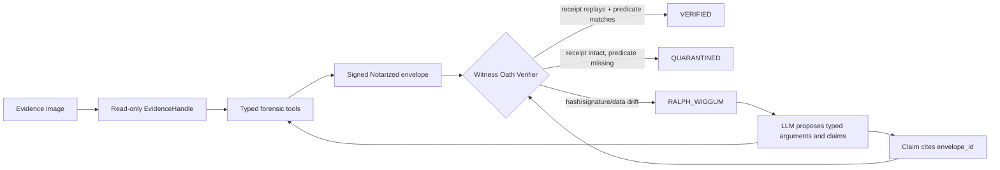

# OATH

Verifier-gated evidence receipts for LLM-assisted digital forensics.

[](https://pypi.org/project/oath-mcp/)
[](https://pypi.org/project/oath-mcp/)
[](LICENSE)

OATH is a published Model Context Protocol server that makes LLM-assisted
forensic claims replayable. It separates what an LLM proposes from what the
evidence proves: forensic tools produce signed `Notarized<T>` envelopes, and
the Witness Oath Verifier promotes only claims that can be deterministically
re-derived from the original evidence bytes.

The preprint accompanying this implementation is hosted on OSF:
[osf.io/rk73m](https://osf.io/rk73m/).

## Quick Start

One canonical Model Context Protocol command installs OATH alongside the
Protocol SIFT baseline on a SANS SIFT Workstation:

```bash
# 1. Protocol SIFT baseline (Claude Code + 5 DFIR skill packs)
curl -fsSL https://raw.githubusercontent.com/teamdfir/protocol-sift/main/install.sh | bash

# 2. Forensic-binary bootstrap (.NET 9, EZ Tools, Hayabusa — what SIFT lacks)
curl -fsSL https://raw.githubusercontent.com/GharsallahDev/oath-mcp/main/scripts/bootstrap-forensic-tools.sh | bash
exec bash

# 3. uv (if not already installed)
curl -LsSf https://astral.sh/uv/install.sh | sh && exec bash

# 4. Wire OATH into Claude Code — the canonical one-liner
claude mcp add --transport stdio oath -- uvx oath-mcp
```

Start a session and confirm the 16 typed tools are connected:

```bash
claude
# inside Claude:
/mcp        # → oath: connected · 16 tools
```

The same one-line install works in any MCP-compatible runtime. The published
`oath-mcp` package on PyPI is versioned, isolated by `uv`, and behaves
identically on the SIFT Workstation and on a developer laptop.

To use the operator CLI (`oath mount`, `oath verify`) instead of driving via
Claude Code, install the package as a tool:

```bash
uv tool install oath-mcp
oath mount path/to/evidence.E01
oath verify <envelope-id>
```

Full forensic-workstation setup, including the macOS Apple Silicon UTM
emulation path and a non-SIFT Docker path, is documented in
[docs/TRY_IT_OUT.md](docs/TRY_IT_OUT.md).

## Relationship to Protocol SIFT

OATH extends [Protocol SIFT](https://github.com/teamdfir/protocol-sift) — the
open-source autonomous-DFIR baseline (Claude Code + five DFIR skill packs +
PDF reporter, installed under `~/.claude/`). Protocol SIFT provides the
agent framework; OATH layers a typed 16-tool MCP server, `Notarized<T>`
envelopes, and a verifier-gated promotion path on top. The Quick Start above
installs Protocol SIFT first, then OATH on top. See
[docs/ARCHITECTURE.md §"How OATH extends Protocol SIFT"](docs/ARCHITECTURE.md#how-oath-extends-protocol-sift)
for the architectural diff.

## Core Idea

LLM-assisted investigation fails dangerously when a fluent model summary is
treated as evidence. OATH treats that as a systems problem. A finding is not
accepted because the model said it; it is accepted only when it cites a
signed receipt whose contents replay.

Each `Notarized<T>` envelope binds:

- Original evidence SHA-256
- Typed tool name and pinned version
- Canonical tool arguments (RFC 8785 JCS)
- Raw tool-output BLAKE3
- Parsed-data BLAKE3 (`data_blake3`)
- Supporting byte offsets when available
- Model identifier and prompt hash when an LLM contributed
- Previous-envelope hash for tamper-evident sequencing
- Ed25519 signature over the signed header

The verifier classifies claims as:

- `VERIFIED`: the receipt and predicate replay successfully
- `QUARANTINED`: the receipt is intact, but the cited claim is not supported
- `RALPH_WIGGUM`: evidence drift or receipt tampering is detected, forcing
  visible abandonment and re-proposal

## Results

The benchmark is DFIR-Metric Module III, using 510 scored string-search
questions in the local harness and a four-candidate answer budget.

| System | TUS@4 |
|---|---:|
| GPT-4.1 published baseline | 38.5% |
| OATH deterministic baseline, no LLM | 78.43% |
| OATH live agent with verifier | 92.75% |

The architectural result matters more than the model headline: typed tool
invocation plus deterministic replay removes a large class of free-form
script-generation failures before any model-specific capability is counted.

Full methodology and audit notes are in [docs/ACCURACY.md](docs/ACCURACY.md).

## Architecture



OATH uses a typed MCP-style tool surface rather than an arbitrary shell. The
LLM can propose arguments and hypotheses; it cannot promote its own findings.
Promotion is reserved for the deterministic verifier.

Detailed trust-boundary notes are in [docs/ARCHITECTURE.md](docs/ARCHITECTURE.md).

## Repository Map

| Path | Purpose |
|---|---|
| `src/oath/receipt/` | `Notarized<T>` envelope, canonicalization, signatures, prompt hashing |
| `src/oath/mcp/` | Typed forensic tool surface and evidence-handle plumbing |
| `src/oath/witness/` | Verifier, claim predicates, self-correction events |
| `src/oath/benchmark/` | DFIR-Metric harness and scoring utilities |
| `tests/integration/test_spoliation.py` | Spoliation, data-integrity, chain, and Daubert-binding tests |

## What OATH Does Not Claim

OATH does not prove legal admissibility, certify tool correctness, make
wrappers honest by magic, prove general DFIR competence, or remove the need
for examiner review. It provides a concrete receipt and verifier pattern for
making LLM-assisted forensic claims auditable.

## Documentation

- [Architecture](docs/ARCHITECTURE.md)
- [Accuracy and benchmark notes](docs/ACCURACY.md)
- [Dataset documentation](docs/DATASETS.md)
- [Try-it-out instructions](docs/TRY_IT_OUT.md)
- [Publication and citation notes](docs/PUBLICATION.md)
- Preprint: [osf.io/rk73m](https://osf.io/rk73m/)
- Package: [pypi.org/project/oath-mcp](https://pypi.org/project/oath-mcp/)

## License

MIT. See [LICENSE](LICENSE).
