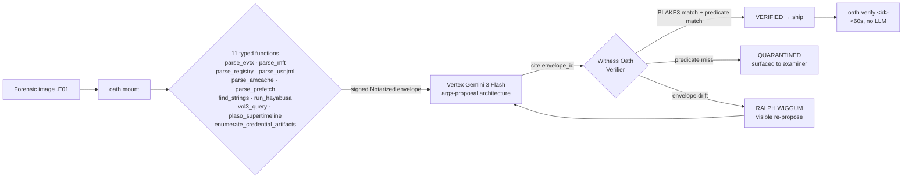

# OATH

**Autonomous DFIR agent. Every forensic claim takes the oath: deterministic re-derivation from the original-image SHA-256, or it doesn't ship.**

OATH is an autonomous incident-response agent built on the SANS Find Evil! pattern #2 — a **Custom MCP Server** with 11 typed forensic functions and architectural (not prompt-based) chain-of-custody enforcement. Every finding is wrapped in a signed `Notarized<T>` envelope. Hallucinations don't get suppressed — they get **quarantined and shown to the examiner**.

## The numbers

| System | DFIR-Metric Module III TUS@4 (510 questions) |
|---|---|
| GPT-4.1 (paper baseline, [arXiv:2505.19973](https://arxiv.org/abs/2505.19973)) | **38.5%** |
| **OATH live agent (Vertex Gemini 3 Flash + verifier)** | **92.75%** |
| OATH deterministic baseline (no LLM at all) | **78.43%** |

Same corpus. Same image. Same scoring rule. Same K=4 candidate budget. **The deterministic-baseline number is the more interesting one** — it shows the architectural lift alone is worth ~40 points before any LLM proposes anything. Full methodology, per-question audit, and a reproduction one-liner: [`docs/ACCURACY.md`](docs/ACCURACY.md).

## Why it exists

Existing autonomous-DFIR agents treat hallucination as a behavioral problem and patch it with prompt-engineering. Fabricated forensic evidence is a different class of failure: in court it's career-ending; in production it's how the wrong person gets handed to legal. OATH treats hallucination as an **architectural** problem and solves it by construction:

1. **The Witness Oath Verifier** — every LLM claim must pass deterministic re-derivation from the original-image SHA-256. Claims that fail are **QUARANTINED** — surfaced to the examiner as "the agent suspected this but couldn't prove it," never promoted to findings.

2. **The Ralph Wiggum Loop** — when a hypothesis fails the verifier, the agent visibly abandons it on-screen and narrates revision under a derived constraint. Self-correction is architecturally enforced, not aspirational. Real, persisted artifact in [`logs/self-correction-demo/manifest.md`](logs/self-correction-demo/manifest.md) — re-run in 2 s via `python scripts/show_self_correction.py`.

3. **The Replay Receipt** — `oath verify <envelope-id>` re-derives any finding from the original image on an examiner's laptop in well under a minute. No LLM, no API key, no MCP server boot. *What cannot replay does not exist.*

4. **A public, reproducible benchmark** — scored against the only published LLM-DFIR benchmark in the space ([DFIR-Metric](https://arxiv.org/abs/2505.19973) Module III). Same corpus, same image, same scoring rule as the published baseline.

## Architecture (SANS Find Evil! pattern #2 — Custom MCP Server)



Full diagram + the Security Boundaries table (architectural vs prompt-based, per Find Evil! judging criterion #4): [`docs/ARCHITECTURE.md`](docs/ARCHITECTURE.md).

## Install — two paths, both tested

### macOS (Apple Silicon) — native install

```bash
git clone https://github.com/GharsallahDev/oath && cd oath
bash scripts/install-tools.sh                  # idempotent
source .oath-tools/env.sh
```

What it installs: dotnet SDK + EZ Tools 2026.5.0 + Hayabusa 3.9.0 + Sleuthkit + Volatility 3 + plaso (via colima Docker amd64 — the only path that works on arm64). All sandboxed under `.oath-tools/`. Total disk: ~1.5 GB.

### SIFT Workstation (Ubuntu x86_64) — what judges will use

```bash
git clone https://github.com/GharsallahDev/oath ~/oath
cd ~/oath
bash scripts/install-on-sift.sh                # uses SIFT-baked tools where possible
source .oath-tools/env.sh
```

What it installs: the same toolchain, but takes advantage of SIFT's pre-installed Sleuthkit + Volatility 3 + plaso (native Linux — no Docker shim needed). Just adds .NET + EZ Tools + Hayabusa. Smoke-tests every tool before reporting success.

Full walkthrough: [`docs/TRY_IT_OUT.md`](docs/TRY_IT_OUT.md). Cleanup is one command: `bash uninstall.sh`.

## Try it in 60 seconds

```bash
# Mount any forensic image read-only — streams SHA-256, persists EvidenceHandle
oath mount path/to/Hacking_Case.E01

# Reproduce the DFIR-Metric benchmark (deterministic; no API key)
python scripts/nss_baseline.py

# OR run the live Gemini agent (requires gcloud auth)
python scripts/nss_baseline.py --live-vertex

# Re-derive any single finding from the original image
oath verify <envelope-id>
```

## What's inside

| Layer | Purpose |
|---|---|
| `src/oath/receipt/` | `Notarized[T]` cryptographic envelope (ed25519 + BLAKE3 + RFC 8785 JCS + hash chain) |
| `src/oath/mcp/` | Custom MCP server exposing 11 typed forensic functions |
| `src/oath/mcp/tools/` | Typed wrappers around EZ Tools / Volatility 3 / Hayabusa / plaso / Sleuthkit — each mints a `Notarized` envelope |
| `src/oath/witness/` | Witness Oath Verifier + Ralph Wiggum self-correction loop |
| `src/oath/agent/` | Hypothesis-driven orchestration → structured `TriageReport` |
| `src/oath/benchmark/` | DFIR-Metric harness + Claude/Gemini live-agent bridges + scorer |
| `src/oath/narrator/` | Rich-based terminal narration of verifier + Ralph Wiggum events |
| `tests/integration/test_spoliation.py` | 14 named tests proving the verifier catches image tampering / signature tampering / persisted-data tampering (`data_blake3`) / Daubert binding tampering (`model_id` + `prompt_hash` signed into the header) / chain-of-custody breaks |

## Documentation

- [`docs/ARCHITECTURE.md`](docs/ARCHITECTURE.md) — full architecture diagram + Security Boundaries table
- [`docs/ACCURACY.md`](docs/ACCURACY.md) — DFIR-Metric numbers, methodology, spoliation contract
- [`docs/DATASETS.md`](docs/DATASETS.md) — every dataset, SHA-256s, license, reproduction
- [`docs/TRY_IT_OUT.md`](docs/TRY_IT_OUT.md) — unabridged install + run walkthrough

## License

MIT. See [`LICENSE`](LICENSE).
