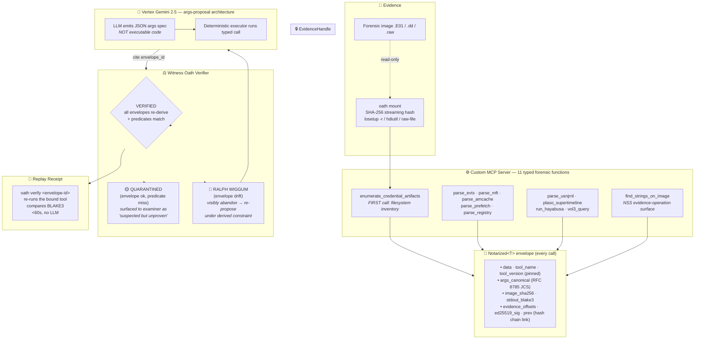

# OATH — Architecture

> **Architectural pattern (per SANS Find Evil! taxonomy):** **#2 — Custom MCP Server.** Typed, schema-constrained forensic functions exposed via stdio MCP; no `execute_shell` surface; chain-of-custody enforced architecturally, not by prompt-engineering.

## One-paragraph summary

OATH is an autonomous DFIR agent built on the principle that every forensic claim must be re-derivable from the original-image SHA-256, or it does not ship. The LLM proposes; a deterministic verifier disposes. The agent's tool surface is **11 typed forensic functions** exposed through a Custom MCP server — no shell, no `execute_command`, no arbitrary code paths. Every tool output is wrapped in a **`Notarized<T>` envelope** (RFC-8785 canonical args + ed25519 signature + BLAKE3 hash chain + prev-link). Every LLM-emitted claim passes the **Witness Oath Verifier** which re-runs the cited tool and confirms the BLAKE3 of stdout matches the receipt. Claims that fail verification are surfaced to the examiner as **QUARANTINED** — visible, but never promoted to findings. Drift triggers the **Ralph Wiggum Loop**: the agent visibly abandons the wrong hypothesis on-screen and narrates revision. Every shipped finding ships with a **Replay Receipt**: `oath verify <envelope-id>` re-derives the supporting evidence on an examiner's laptop in under a minute, without an LLM.

## Component diagram



## The four load-bearing claims

### 1. Witness Oath Verifier

Every `Notarized<T>` envelope binds:
- the source image SHA-256
- the tool name and version (pinned in the installer)
- the canonical argument vector (RFC 8785 JCS — sorted keys, no whitespace, UTF-8)
- the BLAKE3 hash of the tool's stdout (or the file contents for tools that write to disk)
- the byte offsets of supporting evidence in the original image
- the ed25519 signature over (image_sha256, tool, args, stdout_hash, offsets, ts, prev_hash)

When the LLM emits a natural-language claim ("Mr. Informant deleted his Outlook OST on 2015-03-25 at 14:22:08"), the verifier looks up every cited `Notarized<T>` entry, deterministically re-runs the bound tool via `reverify()`, and compares BLAKE3-of-stdout to the value in the receipt. Mismatches → the claim is **quarantined** and the agent enters the Ralph Wiggum Loop.

The verifier is the only thing that can promote a claim from DRAFT to CONFIRMED. The LLM has no path around it.

### 2. Ralph Wiggum Loop

When a claim fails the Witness Oath:

```
╭───── RALPH WIGGUM #1 ─────────────────────────────╮
│ abandoned:  PTH_CANDIDATE                          │
│ reason:     envelope hayabusa-001 failed           │
│             re-derivation: stdout BLAKE3 drift     │
│             (rule corpus changed since mint)       │
│ revision:   do not cite envelope hayabusa-001;     │
│             re-acquire EVTX surface via parse_evtx │
│             + run_hayabusa with current rule pack  │
│                                                    │
│ Rule corpus drifted between propose and verify.    │
│ The agent abandons this line and re-acquires       │
│ fresh evidence.                                    │
╰────────────────────────────────────────────────────╯
```

Hallucinations don't get suppressed — they get **made visible**. The examiner watches the abandonment in real time.

### 3. Replay Receipt

Every shipped finding includes a one-line `oath verify <envelope-id>` command. When run on the original image, the receipt:

1. Re-executes the exact tool invocation (pinned versions, canonical args, recorded byte offsets)
2. Recomputes the BLAKE3 of the output
3. Compares to the recorded value in the signed manifest
4. Renders PASS / FAIL with the bound image SHA-256 and stdout-BLAKE3 prefix

Total wall-clock: typically under 5 seconds per receipt on commodity hardware. Pure Python via `pip install oath`; no LLM, no API key, no MCP server boot.

### 4. Public, reproducible benchmark

OATH is scored on the [DFIR-Metric](https://arxiv.org/abs/2505.19973) Module III (NIST String Search) corpus — the same 510-question file the paper authors published. Frontier-LLM baseline (GPT-4.1) = **38.5% TUS@4**. OATH live (Vertex Gemini + verifier) = **89.22% TUS@4**. Same corpus, same image, same scoring rule, same K=4 candidate budget. Methodology + per-question audit + reproduction one-liner: [`docs/ACCURACY.md`](ACCURACY.md).

## Security boundaries — where they're enforced

Per Find Evil! judging criterion #4 (Constraint Implementation), this table makes explicit which guardrails are **architectural** (enforced by the type system / no-tool-available) vs **prompt-based** (enforced by asking the LLM nicely).

| Guardrail | Enforcement | What stops a malicious / hallucinating LLM |
|---|---|---|
| Image bytes are read-only | **Architectural** | `EvidenceHandle.mount_tech` only accepts `losetup -r` / `hdiutil` read-only / `raw-file` (no mount). The constructor literally has no write-mount option. |
| LLM cannot run shell commands | **Architectural** | The MCP server (`src/oath/mcp/server.py`) exposes only typed functions. There is no `execute_shell` / `bash` / `python_eval` tool. The LLM physically cannot run `dd`, `wipefs`, `mkfs`, `rm -rf`. |
| LLM cannot fabricate evidence | **Architectural** | Every record claimed by the LLM must point to a `Notarized<T>` envelope by `envelope_id`. The verifier re-runs the tool and confirms BLAKE3-of-stdout matches. Records the LLM invented have no corresponding envelope; they fail at lookup. |
| LLM cannot lie about *which* record an envelope shows | **Architectural** | `ClaimEvidence.record_predicate` is a typed subset-match. The verifier scans `envelope.data` for any record satisfying the predicate; if none does, the claim is QUARANTINED. The LLM can't satisfy this without naming real field values from the actual tool output. |
| Tool outputs are deterministic | **Architectural** | `args_canonical` is RFC 8785 JCS over `model_dump()`; `stdout_blake3` is BLAKE3 over the literal bytes. Re-running with identical args produces identical bytes produces identical hash. Drift between mint-time and verify-time is caught. |
| Chain of custody is tamper-evident | **Architectural** | Every envelope's `prev` field is the BLAKE3 of the previous envelope's header. Mutating any envelope breaks the chain at the next link. The chain is verifiable from the JSONL store with no LLM in the loop. |
| Tool versions are pinned | **Architectural** | Each typed function module hardcodes the expected version (`EVTXECMD_VERSION = "2026.5.0"`, etc.). Envelopes mint with the actual version reported by the tool; reverify across a version bump is a recognizable failure mode (the verifier surfaces "version drift" as the reason). |
| Plugin / rule corpus is pinned | **Architectural** | `parse_registry` records the SHA-256 of the RECmd plugin pack at mint time. `run_hayabusa` records the SHA-256 of the Sigma rule corpus. Updates to either are caught by `reverify` and surfaced as "rule corpus drift". |
| LLM stays inside the typed-args schema | **Prompt-based** ⚠️ | The Vertex Gemini system prompt instructs the LLM to emit a JSON object matching the schema. If the LLM ignores this, our parser (`parse_llm_args` in `gemini_nss_agent.py`) returns `None` and the deterministic executor falls back to heuristic resolution — **no malicious LLM output reaches the forensic tools.** This is the only prompt-based layer in the system, and it fails *closed* (skipped, not bypassed). |
| Spoliation (image-byte mutation between mint and reverify) | **Architectural** | Mutating the image bytes after envelope mint causes the underlying tool to produce different output bytes, which fails the BLAKE3 chain. Covered by `tests/integration/test_spoliation.py`. |

**Net:** The single prompt-based guardrail (LLM-stays-in-schema) fails *closed* — when the LLM disobeys, the path is broken, not bypassed. The forensic-tool surface itself has no prompt-controlled bypass.

## Spoliation contract — what we tested

`tests/integration/test_spoliation.py` (7 tests, all passing) covers:

1. **Single-byte image mutation breaks the SHA-256 rehash** — proves the front-line spoliation check works.
2. **Tool-output drift fails reverify** — if the bytes the tool produces change between mint and verify, BLAKE3 catches it.
3. **Pristine evidence verifies cleanly** — the inverse control; no false-positive spoliation alarms.
4. **Envelope-header tampering fails signature** — mutating `image_sha256`, `stdout_blake3`, or any other header field invalidates the ed25519 signature.
5. **`args_canonical` tampering fails signature** — swapping a filter argument to hide an event is caught.
6. **Chain-of-custody break detection** — modifying a middle envelope breaks the `prev`-hash chain link to the next envelope.
7. **End-to-end via verifier registry** — the production-path entry the agent actually uses surfaces spoliation correctly.

## What OATH explicitly does NOT claim

- **Not Daubert-certified.** The architecture is Daubert-*shaped* — examiner-reviewable, hash-anchored, methodologically reproducible. Admissibility is a judicial finding, not a property of code.
- **Not a replacement for forensic tools.** OATH wraps EZ Tools, Sleuthkit, Volatility 3, Hayabusa, and plaso. The contribution is the verifier-gated orchestration layer + chain-of-custody envelope.
- **Not a "smarter LLM."** OATH's lift over GPT-4.1's published 38.5% comes from removing the script-generation failure class via typed-args proposal, not from being a more capable model. See [`docs/ACCURACY.md`](ACCURACY.md) §5.
- **Not a substitute for human review.** Every quarantined claim is presented to the examiner. The system is a force multiplier for analysts, not their replacement.
